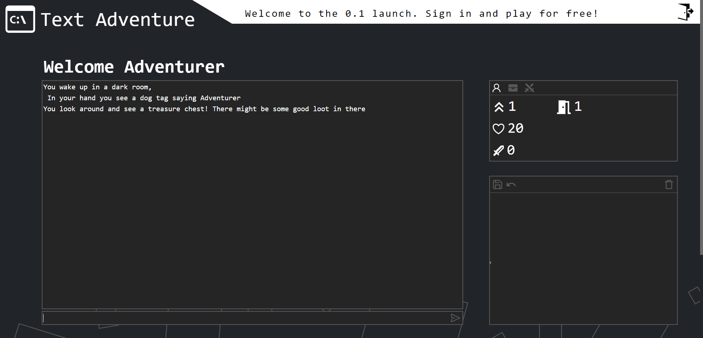

<!-- [![LinkedIn][https://img.shields.io/badge/-LinkedIn-black.svg?style=for-the-badge&logo=linkedin&colorB=555]][linkedin-url]
[![LinkedIn][linkedin-shield]][linkedin-url]
[![LinkedIn][linkedin-shield]][linkedin-url] -->
<!-- PROJECT LOGO -->
 

  
  <h3>A procedurally generating text adventure game in your browser!</h3>

<!-- TABLE OF CONTENTS -->

  
Table of Contents

  <ol>
    <li>
      <a href="#about-the-project">About The Project</a>
      <ul>
        <li><a href="#built-with">Built With</a></li>
        <li><a href="#built-with">Hosted With</a></li>
      </ul>
    </li>
    <li>
      <a href="#showcase">Showcase</a>
    </li>
    <li>
        <a href="#roadmap">Roadmap</a>
    </li>
  </ol>

<!-- ABOUT THE PROJECT -->
## About The Project

 
 
Have you ever wanted to play your old games for nostalgia? 
 
Want to relive your childhood years of exploring dungeons and discussing what you found last night with your friends?
 
Or do you just want to try out a modern day adaptation of an old classic?
 
 
If you are interested in any of these, you should give this completely online web based text adventure game a try!

Here's why:
* Clean darkmode aesthetic just like that good old commandline.
* Fully cloud synced gameplay, so you can continue your adventure anywhere.
* Completely procedurally generated meaning the adventure is never over!
* Play and chat with other people in real time.
* Participate on the global leaderboards for the top place.
* Modern day UX optimization for the best text adventure experience possible.

The game is ofcourse completely free and needs nothing to be installed, just go to the website and start adventuring.

### Built With

* [ASP.NET Core (3.1)](https://docs.microsoft.com/en-us/aspnet/core/?view=aspnetcore-3.1)
* [SignalR](https://docs.microsoft.com/en-us/aspnet/core/signalr/introduction?view=aspnetcore-6.0)
* [Entity Framework Core](https://docs.microsoft.com/en-us/ef/core/)
* [xUnit](https://xunit.net/)
* [React.js](https://reactjs.org/)
* [Bootstrap](https://getbootstrap.com)
* [Cypress](https://www.cypress.io/)

### Hosted With
* [Azure App Service (back-end)](https://vercel.com/)
* [Vercel (front-end)](https://vercel.com/)
* [Sparked Host (MySQL database)](https://sparkedhost.com/)

(<a href="#top">back to top</a>)

<!-- Showcase -->
## Showcase
 
<h3>Register</h3>

Easily register or login via popout modal.

  

 
<h3>Create Adventurer</h3>

Create / Select / Delete adventurers.

  

 
<h3>Gameplay Page</h3>

After selecting an adventurer get brought to the gameplay page with all useful information at your fingertips.

  

 
<h3>Gameplay Commandline</h3>

Old school style commandline with all the expected quality of life features

  

 

interactable UI to reduce to amount of unnecessary typing.

<h3>Gameplay UI</h3>
  

 

Drawing field to draw whatever you want, it is even cloud saved!

<h3>Gameplay Drawing</h3>
  

 
<h3>Gameplay Chat</h3>

Chat with friends.

  

 
<h3>Mobile Friendly</h3>

Responsive layout.

      

<!-- ROADMAP -->
## Roadmap

- [x] Create website
- [x] Setup JWT authentication
- [x] SignalR / Websocket connections 
- [ ] Gameplay
    - [x] Room generation
    - [x] Dynamic entity generation
    - [x] input handler
    - [ ] Dynamic useable items
    - [ ] co-op combat
    - [ ] room generation crawler
- [x] Testing
    - [x] xUnit
    - [x] Cypress
- [x] CI/CD
    - [x] Front-end
    - [x] Back-end

(<a href="#top">back to top</a>)

<!-- MARKDOWN LINKS & IMAGES
[linkedin-shield]: https://img.shields.io/badge/-LinkedIn-black.svg?style=for-the-badge&logo=linkedin&colorB=555
[linkedin-url]: https://linkedin.com/in/othneildrew]

[linkedin-shield]: 
[linkedin-url]: https://linkedin.com/in/othneildrew]

[linkedin-shield]: https://img.shields.io/badge/-LinkedIn-black.svg?style=for-the-badge&logo=linkedin&colorB=555
[github-url]: https://linkedin.com/in/othneildrew] -->
